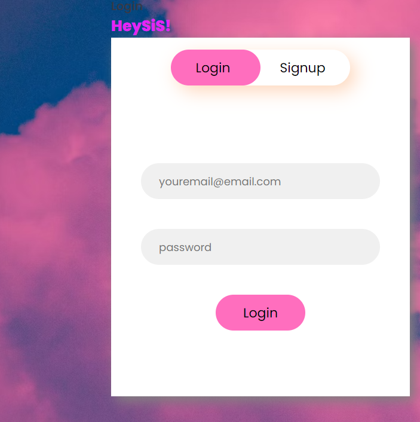
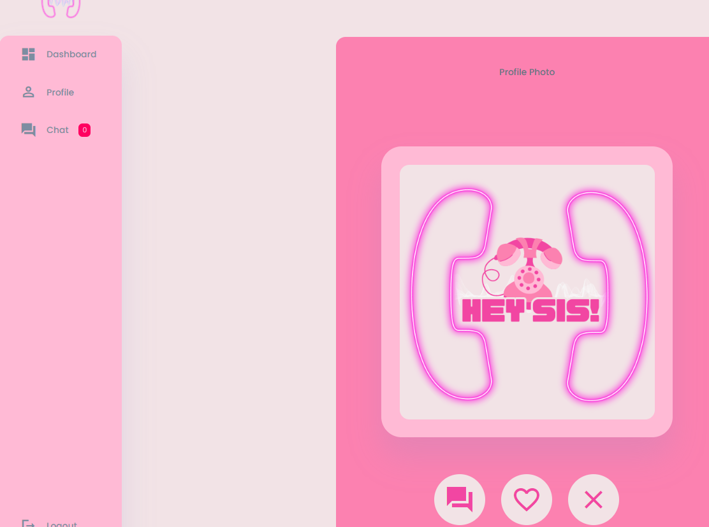

# Hey Sis! 

## Project Description
Hey Sis! is a social media app that connects girls in your area, to meet new people, and hang out with activities in your area. With a match and dislike feature to really fine tune youe experience to meet amazing people nearby.

## Table of Content
1. Features
2. Technologies
3. Collaborators
4. Contributions

## Features
User Authentication: Allows user to login and register securly.
Database intergration: Abitlity to store user data, matches, chats, and favorite activites.
Responsive Design: Responsive across all devices.

## Technologies
Frontend: HTML CSS JavaScript, 
Backend: Node.js, Express.js, Handlebars
Database: PostgreSQL
Deployment: Render

## Collaborators
Alicia Bromfield
Yanique Brooks
Rachael Clarke

## Deployed Page
https://github.com/yaniquebro/hey-sis.git

Screenshot:
  

## Contributions 

